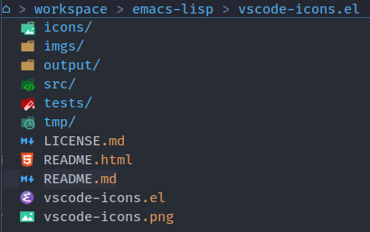

vscode-icons.el
==================

Library for displaying VSCode icons in Emacs.

## Introduction

This library displays beautiful SVG icons adopted from modern VSCode extensions such as Microsoft's [vscode-icons](https://github.com/microsoft/vscode-icons), VSCode Icons Team's [vscode-icons](https://github.com/vscode-icons/vscode-icons), and Material Theme's [vscode-material-icon-theme](https://github.com/material-extensions/vscode-material-icon-theme).

It improves existing packages like [all-the-icons.el](https://github.com/domtronn/all-the-icons.el), [nerd-icons.el](https://github.com/rainstormstudio/nerd-icons.el), and [vscode-icon-emacs](https://github.com/jojojames/vscode-icon-emacs) by providing various original, pretty, and high-quality icons using SVG format. The other packages [all-the-icons.el](https://github.com/domtronn/all-the-icons.el) and [nerd-icons.el](https://github.com/rainstormstudio/nerd-icons.el) only display single color icons while [vscode-icon-emacs](https://github.com/jojojames/vscode-icon-emacs) only display PNG icons, whose quality might be affected when being resized.

## Usage

Below are some useful APIs to get icons:

- `vscode-icons-icon-for-file`
- `vscode-icons-icon-for-dir`
- `vscode-icons-icon-for-mode`
- `vscode-icons-icon-for-imenu`
- `vscode-icons-icon-for-buffer`

Sample code to use the APIs to prepend the icon in front of a file name.

```elisp
(defun prepend-file-icon (file-name)
  "Prepend an icon in front of a file name."
  (let* ((icon (if (file-directory-p file-name)
                   (or (vscode-icons-icon-for-dir file-name)
                       (vscode-icons-default-dir-icon))
                 (or (vscode-icons-icon-for-file file-name)
                     (vscode-icons-default-file-icon)))))
    ;; Return a new string which is prepended with the file icon.
    (concat (propertize " " 'display icon) " " file-name)))
```

Illustration of integrating `vscode-icons` into `dired-mode`:



## Contributing

All icons are stored in the folder [icons](icons). Their structure is like below:

- [icons/vscode](icons/vscode): the official Microsoft's VSCode icons.
- [icons/vscode-icons](icons/vscode-icons): VSCode Icons Team's icons.
- [icons/material](icons/material): Material Theme icons.
- [icons/papirus](icons/papirus): Papirus theme icons.

## Acknowledgements

This package is inspired by the following projects:

- [all-the-icons.el](https://github.com/domtronn/all-the-icons.el): Emacs library to display icons using various icon fonts.
- [nerd-icons.el](https://github.com/rainstormstudio/nerd-icons.el): Emacs library to display icons using Nerd fonts.
- [vscode-icon-emacs](https://github.com/jojojames/vscode-icon-emacs): Emacs library to display VSCode icons in PNG format.
- [vscode-icons](https://github.com/microsoft/vscode-icons): VSCode extension to the official Microsoft's VSCode icons.
- [vscode-icons](https://github.com/vscode-icons/vscode-icons): VSCode extension to display VSCode Icons Team's icons.
- [vscode-material-icon-theme](https://github.com/material-extensions/vscode-material-icon-theme): VSCode extension to display Material Theme icons.
- [papirus-icon-theme](https://github.com/PapirusDevelopmentTeam/papirus-icon-theme): Papirus icon theme for Linux.
